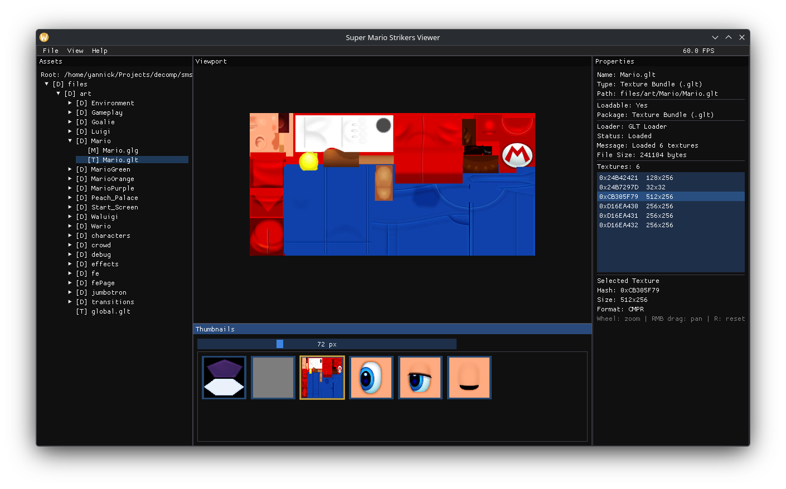

# Super Mario Strikers - Asset Viewer

A cross-platform model and content viewer for Super Mario Strikers (Nintendo GameCube, 2005).

## Important Legal Disclaimer

**This project does NOT contain any assets from the original game.**

To use this viewer, you **MUST** own a legitimate copy of Super Mario Strikers and extract the assets yourself. This project is strictly for educational and archival purposes, utilizing knowledge gained from the [smstrikers-decomp](https://github.com/yannicksuter/smstrikers-decomp) project.

**No game files, textures, models, or any copyrighted content from Super Mario Strikers will ever be included in this repository.**

## About

This project is a companion tool to the Super Mario Strikers decompilation project. It uses the knowledge gained during the decompilation process to read and interpret game assets for viewing and analysis purposes.



### Viewer Progress
- Most `.glt` texture bundles load and display textures
- Some bundles/textures are still broken and need investigation
- `.glg` model bundle support is not implemented yet

### Planned Features
- Model viewing (initial focus)
- Animation playback
- Script analysis
- Asset inspection tools

## Building

### Prerequisites

- CMake 3.15 or higher
- C++17 compatible compiler
  - GCC 7+ (Linux)
  - Clang 5+ (macOS)
  - MSVC 2017+ (Windows)
- Ninja build system (optional, but recommended)
- OpenGL development libraries

### Build Instructions

```bash
# Clone the repository
git clone https://github.com/yannicksuter/smstrikers-viewer.git
cd smstrikers-viewer

# Initialize submodules (if any)
git submodule update --init --recursive

# Create build directory
mkdir build && cd build

# Configure with CMake (using Ninja generator)
cmake -G Ninja ..

# Build
ninja

# Or use CMake's generic build command
cmake --build .
```

### Platform-Specific Notes

#### macOS
```bash
# Install dependencies via Homebrew
brew install cmake ninja
```

#### Linux (Debian/Ubuntu)
```bash
# Install dependencies
sudo apt-get install cmake ninja-build build-essential libgl1-mesa-dev
```

#### Windows
- Install Visual Studio 2019 or later with C++ support
- Install CMake from https://cmake.org
- Optionally install Ninja from https://ninja-build.org

## Usage

### Running the Viewer

```bash
# From the project root directory
./build/bin/smstrikers-viewer

# Or with command-line options
./build/bin/smstrikers-viewer --no_gui          # Headless mode (for testing)
```

### Setting Up Assets

1. **Extract game assets** from your legitimate copy of Super Mario Strikers:
   - Use Dolphin Emulator's filesystem browser (Right-click game → Properties → Filesystem)
   - Export files to your configured asset root (default: `game_assets/`)

2. **Launch the viewer** and browse your assets!

### Controls (might be outdated..)

- **Right Mouse Button**: Rotate camera around object
- **Middle Mouse Button**: Pan camera
- **Mouse Wheel**: Zoom in/out
- **Home Key**: Reset camera to default position
- **ESC**: Exit application

## Contributing

This is currently a personal research project. Contributions, suggestions, and feedback are welcome!

Please ensure:
- No copyrighted game assets are included in any pull requests
- Code follows the existing style and conventions
- Cross-platform compatibility is maintained

## Related Projects

- [smstrikers-decomp](https://github.com/yannicksuter/smstrikers-decomp) - Super Mario Strikers decompilation project

## License

This project is licensed under the MIT License - see the LICENSE file for details.

**Nintendo, Super Mario Strikers, and all related trademarks are property of Nintendo Co., Ltd.**

This project is not affiliated with, endorsed by, or connected to Nintendo in any way.

## Acknowledgments

- This project wouldn’t be possible without the collective knowledge, tools, and support of the broader decompilation community. Huge thanks to contributors of other GameCube decomp projects, the teams behind decomp.dev and decomp.me, and the incredibly helpful discussions happening on Discord. These resources have been invaluable for solving problems, speeding up setup, and staying motivated throughout the process.
- Open source library maintainers
